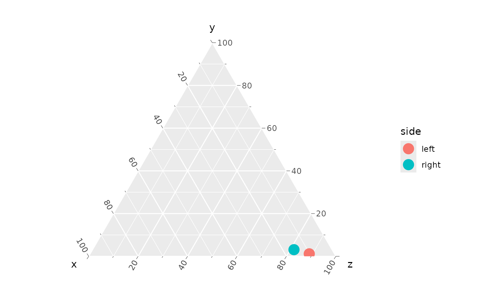
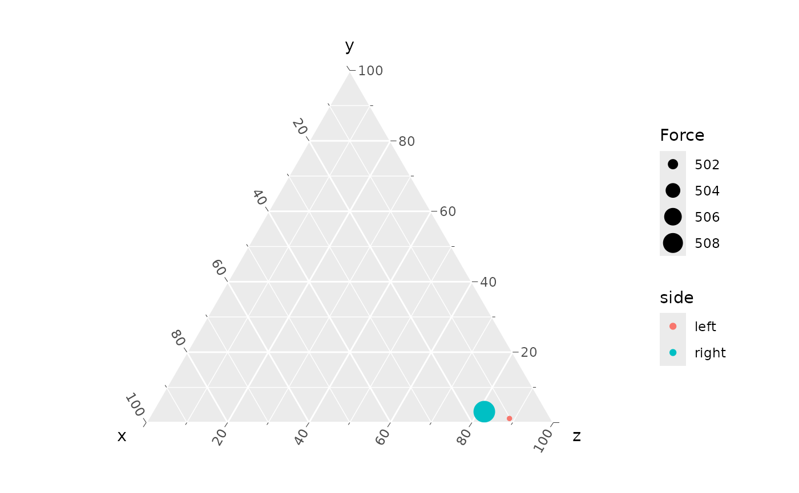

# Working with stl files

Stereolithography (`.stl`) mesh files can be exported from most
segmentation software. In our workflow, there are two files for each
muscle, wherein the origin and insertion attachment areas of the muscle
are “mapped” onto the surface of a bone model (see Cost et al., 2020,
2022; Wilken et al., 2019, 2020 for description).

There is no directionality to the calculation of either centroid size
(area) or location from a mesh, so either surface can be the “origin”.
If you are generating Maya mel code for generating a model + muscle
vectors, then the order matters to get the arrowhead on the correct end,
however there is a flag in
[`make_mel()`](https://middleton-lab.github.io/MuscleTernary/reference/make_mel.md)
to reverse the arrows.

**Important**: you should export stl meshes as *binary, with little
endian byte encoding* (not ASCII or binary with big endian). If not, you
will get a cryptic error that will be very difficult to diagnose.
`MuscleTernary` has a wrapper function
[`read_stl()`](https://middleton-lab.github.io/MuscleTernary/reference/read_stl.md)
around the `rgl` pachage `readSTL()` function which *should* catch any
read errors, but it hasn’t been tested for all possible cases (i.e.,
those I haven’t encountered yet). If you are reading stl files in
directly, use
[`read_stl()`](https://middleton-lab.github.io/MuscleTernary/reference/read_stl.md).

The package includes a pair of files that map the origin and insertion
areas of the left m. Pterygoideus dorsalis (mPTd): `L_mPTd_Or.stl` and
`L_mPTd_Ins.stl`. The right mPTd are also included and will be used
later in this tutorial.

`system.file(...)` allows us to open a file that was installed with the
package. In most cases, you would use a path to your mesh file in its
place.

``` r

library(tidyverse)
library(MuscleTernary)

# Save the local path to the stl file.
stl_path <- system.file("extdata",
                        "L_mPTd_Ins.stl",
                        package = "MuscleTernary")

stl <- read_stl(stl_path)
```

[`read_stl()`](https://middleton-lab.github.io/MuscleTernary/reference/read_stl.md)
returns a matrix with (x, y, z) coordinates of the vertices of the mesh
triangles.

``` r

stl[1:10, ]
#>           [,1]       [,2]      [,3]
#>  [1,] 80.15495 -11.792723 -570.9537
#>  [2,] 80.72946 -11.396370 -571.3650
#>  [3,] 79.95493 -11.389565 -571.5762
#>  [4,] 80.84564  -9.106031 -573.8356
#>  [5,] 80.04286  -9.215285 -573.6454
#>  [6,] 80.41844  -9.701449 -573.2871
#>  [7,] 80.15350 -10.181118 -572.8048
#>  [8,] 79.55407 -10.362929 -572.4216
#>  [9,] 80.77268 -10.513458 -572.4617
#> [10,] 80.15495 -11.792723 -570.9537

# Dimensions of the matrix
dim(stl)
#> [1] 6423    3
```

## Centroid location and centroid size

The centroid location (often just the “centroid”) of the mesh is simply
the mean of each column. To simply usage,
[`centroid_location()`](https://middleton-lab.github.io/MuscleTernary/reference/centroid_location.md)
takes a single argument with the string path to the file.

``` r

colMeans(stl)
#> [1]   64.784475    8.529847 -567.928419

centroid_location(stl_path)
#> [1]   64.784475    8.529847 -567.928419
```

The size of the centroid is the 3D distance of each vertex from the
centroid.

``` r

# Calculate the centroid
centroid <- centroid_location(stl_path)

# Apply the distance formula
sqrt(sum((centroid[1] - stl[, 1]) ^ 2 +
           (centroid[2] - stl[, 2]) ^ 2 +
           (centroid[3] - stl[, 3]) ^ 2))
#> [1] 2576.131

centroid_size(stl_path)
#> [1] 2576.131
```

## Area of an `stl` mesh

The area of an stl mesh is the summed area of all the triangles making
up the mesh.

``` r

area <- stl_area(stl_path)
area
#> [1] 3280.389
```

## Deriving ternary coordinates from a pair of stl meshes

To get to ternary coordinated from stl mesh files, first we need the
locations of the centroids. Here we use the left mPTd:

``` r

L_mPTd_Or <- centroid_location(system.file("extdata",
                                            "L_mPTd_Or.stl",
                                            package = "MuscleTernary"))
L_mPTd_Ins <- centroid_location(system.file("extdata",
                                            "L_mPTd_Ins.stl",
                                            package = "MuscleTernary"))
```

[`centroid_location()`](https://middleton-lab.github.io/MuscleTernary/reference/centroid_location.md)
returns a 3-element vector, which we can extract into a tibble. There
are other ways to do this step, but this is the most straightforward, if
more verbose.

``` r

mPTd_L <- tibble(
  muscle = "mPTd",
  side = "left",
  x_origin = L_mPTd_Or[1],
  y_origin = L_mPTd_Or[2],
  z_origin = L_mPTd_Or[3],
  x_insertion = L_mPTd_Ins[1],
  y_insertion = L_mPTd_Ins[2],
  z_insertion = L_mPTd_Ins[3]
)

mPTd_L
#> # A tibble: 1 × 8
#>   muscle side  x_origin y_origin z_origin x_insertion y_insertion z_insertion
#>   <chr>  <chr>    <dbl>    <dbl>    <dbl>       <dbl>       <dbl>       <dbl>
#> 1 mPTd   left      26.7     21.4    -456.        64.8        8.53       -568.
```

We then repeat the same for the right mPTd and bind the left and right
together to have some comparative data:

``` r

R_mPTd_Or <- centroid_location(system.file("extdata",
                                            "R_mPTd_Or.stl",
                                            package = "MuscleTernary"))
R_mPTd_Ins <- centroid_location(system.file("extdata",
                                            "R_mPTd_Ins.stl",
                                            package = "MuscleTernary"))

mPTd_R <- tibble(
  muscle = "mPTd",
  side = "right",
  x_origin = R_mPTd_Or[1],
  y_origin = R_mPTd_Or[2],
  z_origin = R_mPTd_Or[3],
  x_insertion = R_mPTd_Ins[1],
  y_insertion = R_mPTd_Ins[2],
  z_insertion = R_mPTd_Ins[3]
)

mPTd <- bind_rows(mPTd_L, mPTd_R)
mPTd
#> # A tibble: 2 × 8
#>   muscle side  x_origin y_origin z_origin x_insertion y_insertion z_insertion
#>   <chr>  <chr>    <dbl>    <dbl>    <dbl>       <dbl>       <dbl>       <dbl>
#> 1 mPTd   left      26.7     21.4    -456.        64.8       8.53        -568.
#> 2 mPTd   right    -23.4     18.7    -460.       -67.2      -0.988       -560.
```

Passing that tibble to
[`coords_to_ternary()`](https://middleton-lab.github.io/MuscleTernary/reference/coords_to_ternary.md)
produces ternary coordinates. By not using the `grouping` argument, we
get coordinates for both left and right (not the average of the two). We
can then make a simple ternary plot comparing the muscles’ orientations.

``` r

coords_to_ternary(mPTd)
#> # A tibble: 2 × 5
#>   muscle side      x     y     z
#>   <chr>  <chr> <dbl> <dbl> <dbl>
#> 1 mPTd   left   10.2  1.16  88.6
#> 2 mPTd   right  15.4  3.09  81.5

coords_to_ternary(mPTd) |> 
  ggtern(aes(x, y, z, color = side)) +
  geom_point(size = 5)
```



## Estimating PCSA

The origin and insertion meshes can be used to estimate physiological
cross-sectional area (PCSA; see Sellers, et al., 2017 for additional
discussion). PSCA is calculated as the volume of a frustum with areas
equal to the attachments ($`V_m`$) divided by fascicle length ($`l_f`$)
and multiplied by the cosine of the angle of pennation ($`\theta`$).

``` math
PCSA = \frac{V_m}{l_f} \cdot \cos(\theta)
```

where

``` math
V_m = \frac{l_m}{3} \cdot (A_{or} \cdot A_{ins} + \sqrt{A_{or} \cdot A_{ins}})
```

$`l_m`$ is the distance from the centroid of the origin to the centroid
of the insertion and $`A_{or}`$ and $`A_{ins}`$ are the origin and
insertion areas, respectively.

For a pair of stl meshes and values for $`l_f`$ (`fascicle_length` which
defaults to 1) and $`\theta`$ (`theta` which defaults to 0, no
pennation),
[`pcsa()`](https://middleton-lab.github.io/MuscleTernary/reference/PCSA.md)
calculates PCSA.

Note that by default
[`pcsa()`](https://middleton-lab.github.io/MuscleTernary/reference/PCSA.md)
uses the areas of the stl meshes. The Boolean flag `stl_area` will use
centroid size if set to `FALSE`.

``` r

PCSA <- pcsa(system.file("extdata",
                         "L_mPTd_Or.stl",
                         package = "MuscleTernary"),
             system.file("extdata",
                         "L_mPTd_Ins.stl",
                         package = "MuscleTernary"))
#> Assuming theta is measured in radians.
#> Assuming units are mm.
#> Using mesh area for calculation.
PCSA
#> [1] 1670.846
```

By default,
[`pcsa()`](https://middleton-lab.github.io/MuscleTernary/reference/PCSA.md)
assumes that $`\theta`$ is measured in radians and that the units of
length and area are in millimeters. This is important in order to scale
muscle force properly.

## Estimating muscle force

PCSA multiplied by the specific tension of the muscle tissue,
$`T_{specific}`$, yields an estimate of muscle force output (Porro et
al., 2011; Holmes and Taylor, 2021). $`T_{specific}`$ (`Tspec`) defaults
to 0.3 $`N / mm^2`$, which is a reasonable value for reptile muscle.

``` r

muscle_force(PCSA)
#> [1] 501.2537
```

## Putting it together

We can now estimate muscle force for mPTd and scale the ternary plot
points according to size.

We will add a column to `mPTd` with the force estimates:

``` r

mPTd <- mPTd |> 
  mutate(
    Force = c(muscle_force(pcsa(system.file("extdata",
                                            "L_mPTd_Or.stl",
                                            package = "MuscleTernary"),
                                system.file("extdata",
                                            "L_mPTd_Ins.stl",
                                            package = "MuscleTernary"))),
              muscle_force(pcsa(system.file("extdata",
                                            "R_mPTd_Or.stl",
                                            package = "MuscleTernary"),
                                system.file("extdata",
                                            "R_mPTd_Ins.stl",
                                            package = "MuscleTernary"))))
  )
mPTd
#> # A tibble: 2 × 9
#>   muscle side  x_origin y_origin z_origin x_insertion y_insertion z_insertion
#>   <chr>  <chr>    <dbl>    <dbl>    <dbl>       <dbl>       <dbl>       <dbl>
#> 1 mPTd   left      26.7     21.4    -456.        64.8       8.53        -568.
#> 2 mPTd   right    -23.4     18.7    -460.       -67.2      -0.988       -560.
#> # ℹ 1 more variable: Force <dbl>
```

And make a ternary plot

``` r

coords_to_ternary(mPTd) |> 
  ggtern(aes(x, y, z, color = side, size = Force)) +
  geom_point()
```



By default, ggplot scales the point range to maximize difference, so the
relatively small difference between left and right is exaggerated. See
the article “Make a ternary plot” for details on modifying the size
scale range.

## References

Cost IN, Middleton KM, Sellers KC, Echols MS, Witmer LM, Davis JL,
Holliday CM. 2020. Palatal Biomechanics and Its Significance for Cranial
Kinesis in *Tyrannosaurus rex*. [Anat Rec
303:999-1017.](http://dx.doi.org/10.1002/ar.24219)

Cost IN, Sellers KC, Rozin RE, Spates AT, Middleton KM, Holliday CM.
2022. 2D and 3D visualizations of archosaur jaw muscle mechanics,
ontogeny and phylogeny using ternary diagrams and 3D modeling. [J Exp
Biol 225](http://dx.doi.org/10.1242/jeb.243216)

Holmes, M., and A. B. Taylor. 2021. The influence of jaw-muscle
fibre-type phenotypes on estimating maximum muscle and bite forces in
primates. Interface Focus 11:20210009.

Porro, L. B., C. M. Holliday, F. Anapol, L. C. Ontiveros, L. T.
Ontiveros, and C. F. Ross. 2011. Free body analysis, beam mechanics, and
finite element modeling of the mandible of *Alligator mississippiensis*.
[J. Morphol. 272:910-937.](http://dx.doi.org/10.1002/jmor.10957)

Sellers, K. C., K. M. Middleton, J. L. Davis, and C. M. Holliday. 2017.
Ontogeny of bite force in a validated biomechanical model of the
American alligator. [J. Exp. Biol.
220:2036-2046.](http://dx.doi.org/10.1242/jeb.156281)

Wilken AT, Middleton KM, Sellers KC, Cost IN, Holliday CM. 2019. The
roles of joint tissues and jaw muscles in palatal biomechanics of the
Savannah monitor (*Varanus exanthematicus*) and their significance for
cranial kinesis. [J Exp Biol
222:1-14.](http://dx.doi.org/10.1242/jeb.201459)

Wilken AT, Sellers KC, Cost IN, Rozin RE, Middleton KM, Holliday CM.
2020. Connecting the chondrocranium: Biomechanics of the suspensorium in
reptiles. [Vertebrate Zoology
70:275-290.](http://dx.doi.org/10.26049/VZ70-3-2020-02)
