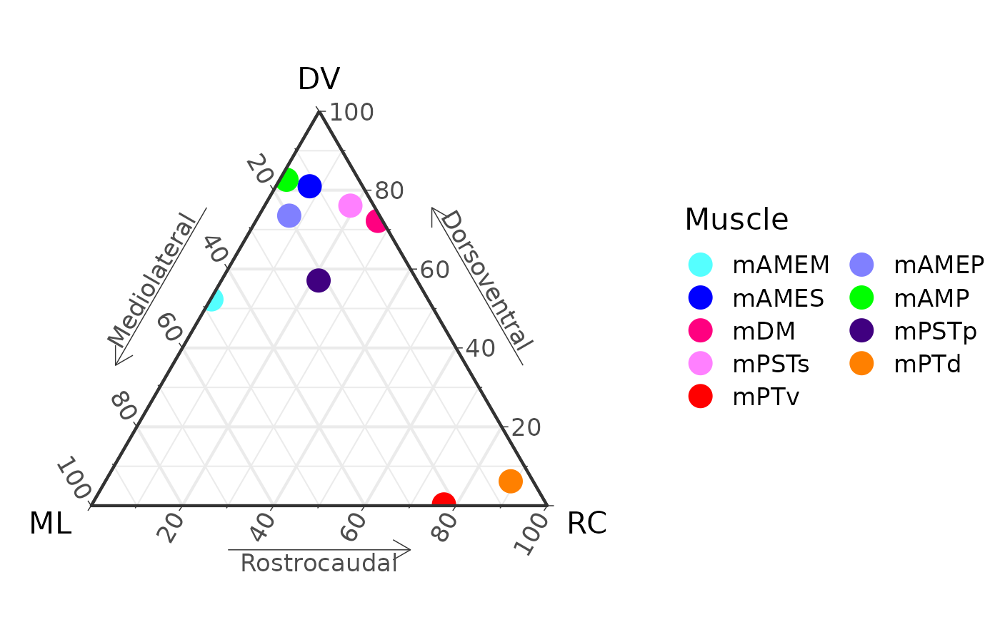
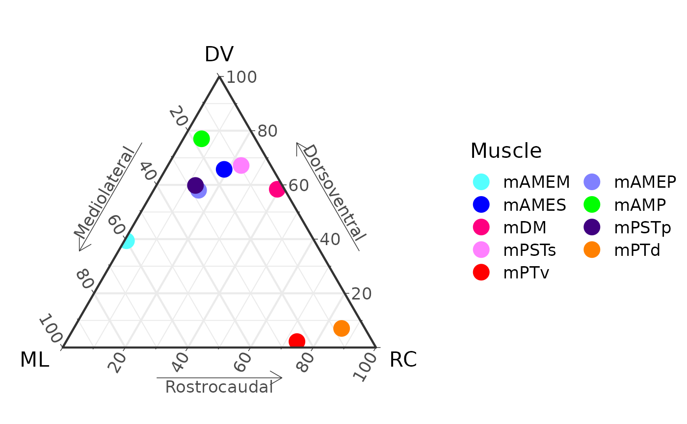
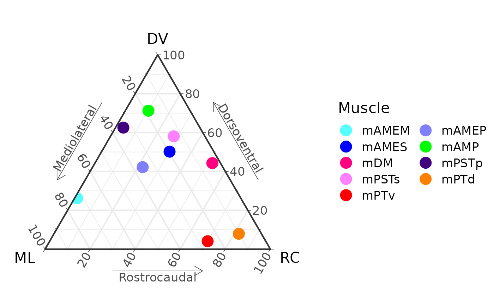

# Animate a ternary plot

To animate a ternary plot, you need two sets of points to interpolate
between (the start and end points). Here we use the *Alligator* data for
the adult AL_008 specimen and the juvenile AL_031 specimen.

Load AL008 and AL031 data, calculate means, and merge into one
data.frame.

``` r

library(MuscleTernary)

AL_008 <- read_csv(system.file("extdata",
                               "AL_008_data.csv",
                               package = "MuscleTernary"),
                   show_col_types = FALSE) |>
  dplyr::select(-side, -force) |>
  coords_to_ternary(grouping = c("muscle"))

AL_031 <- read_csv(system.file("extdata",
                               "AL_031_data.csv",
                               package = "MuscleTernary"),
                   show_col_types = FALSE) |>
  dplyr::select(-side, -force) |>
  coords_to_ternary(grouping = c("muscle"))

M <- left_join(AL_031, AL_008, by = "muscle", suffix = c("_1", "_2")) |>
  as.data.frame()
M
#>   muscle       x_1        y_1        z_1      x_2       y_2       z_2
#> 1  mAMEM 47.482874 52.3157521  0.2013744 72.64625 26.219727  1.134019
#> 2  mAMEP 19.814767 73.5379074  6.6473253 35.56140 42.203549 22.235051
#> 3  mAMES 11.606622 80.9880097  7.4053679 19.65373 50.172370 30.173902
#> 4   mAMP 15.856535 82.6430887  1.5003768 18.49881 71.252822 10.248368
#> 5    mDM  1.046126 72.2162632 26.7376106  3.60419 44.281172 52.114638
#> 6  mPSTp 21.592986 57.0972841 21.3097296 33.96304 62.549390  3.487569
#> 7  mPSTs  5.130132 76.0818728 18.7879948 13.86243 58.065759 28.071813
#> 8   mPTd  4.918202  6.1925587 88.8892394 10.03020  7.917902 82.051895
#> 9   mPTv 22.494155  0.3248712 77.1809739 25.78391  4.092200 70.123890
```

`x_1`, `y_1`, and `z_1` are the starting locations in ternary space.
`x_2`, `y_2`, and `z_2` are the ending locations.

We then interpolate each row into `length_out` new rows. Here we make
100 steps in between.

``` r

length_out <- 100
D <- list()

for (i in 1:nrow(M)) {
  D[[i]] <- interpolate_ternary(M[i, ],
                                length_out = length_out)
}
D <- do.call(rbind, D)
```

Basically we are making a list of data.frames and then binding them all
together at the end with
[`do.call()`](https://rdrr.io/r/base/do.call.html).

To make the animation, first we make a set of all the plots. Here we
iterate through `.frame` and make a plot for each. Add to a list of
plots.

``` r

P <- list()

for (i in 1:length_out) {
  d <- D |> filter(.frame == i)
  P[[i]] <- ggtern(d, aes(x = x, y = y, z = z,
                          color = muscle)) +
    geom_point(size = 5) +
    muscle_color_map() +
    labs( x       = "ML",
          xarrow  = "Mediolateral",
          y       = "DV",
          yarrow  = "Dorsoventral",
          z       = "RC",
          zarrow  = "Rostrocaudal") +
    theme_bw(base_size = 16) +
    theme_showarrows() +
    guides(colour = guide_legend(override.aes = list(size = 5),
                                 ncol = 2, byrow = TRUE))
}
```

`P` now is a list of plots (here with a length of 100, because we used
100 steps). We can plot a few as examples:

``` r

P[[1]]
#> Ignoring unknown labels:
#> • xarrow : "Mediolateral"
#> • yarrow : "Dorsoventral"
#> • zarrow : "Rostrocaudal"
```



``` r

P[[50]]
#> Ignoring unknown labels:
#> • xarrow : "Mediolateral"
#> • yarrow : "Dorsoventral"
#> • zarrow : "Rostrocaudal"
```



``` r

P[[100]]
#> Ignoring unknown labels:
#> • xarrow : "Mediolateral"
#> • yarrow : "Dorsoventral"
#> • zarrow : "Rostrocaudal"
```



## Saving the animation

To save the animation to a `.gif` file, we have to use additional
software: ImageMagick. Installation of ImageMagick is beyond the scope
of this article, but it’s not too difficult.

You have to set options with `ani.options` differently for MacOS
vs. Windows. Then call
[`saveGIF()`](https://rdrr.io/pkg/animation/man/saveGIF.html).

``` r

# Set interval to 1/24 s.
ani.options(interval = 1/24)

# For MacOS with ImageMagick installed somewhere on the path
# e.g., using homebrew.

# ani.options(convert = "convert")

# For Windows, install the ImageMagick standalone release:
# (http://www.imagemagick.org/script/binary-releases.php). Use a
# variation of the next line to set the absolute path to convert.exe.

# ani.options(convert = 'C:\\Program Files\\ImageMagick\\convert.exe')

saveGIF({for (i in 1:length_out) print(P[[i]])},
        movie.name = "ternary_animation.gif",
        ani.width = 800, ani.height = 600)
```
