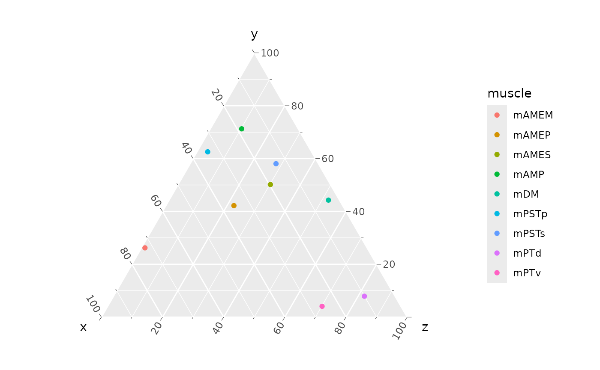
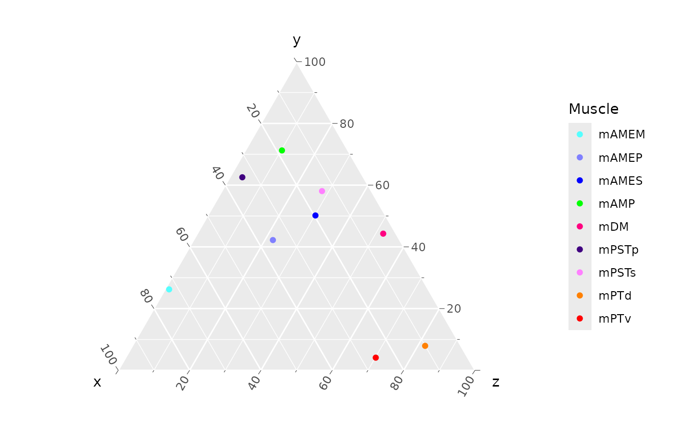
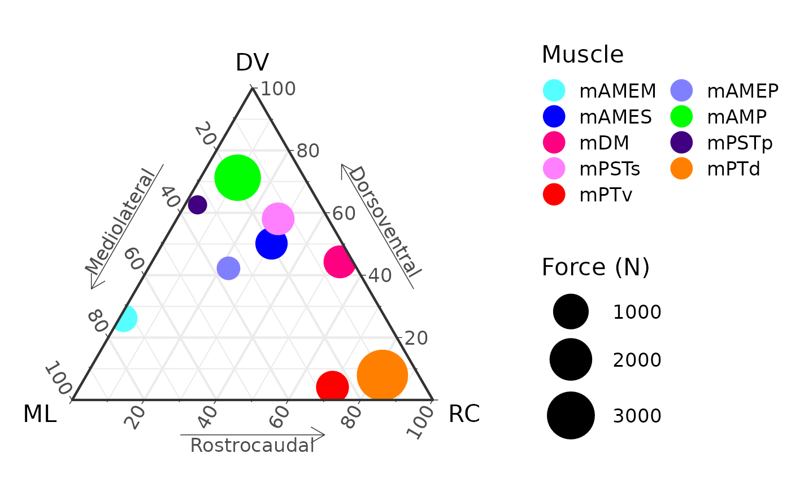

# Make a ternary plot

To create a ternary plot from origin and insertion data, first we need
data. Attachment centroid data are available for the AL_008 specimen of
*Alligator mississippiensis* (although similar data can be extracted
directly from stl files; see the “Working with stl files” article).

``` r

library(MuscleTernary)
library(ggtern)
library(readr)

AL008 <- read_csv(system.file("extdata",
                              "AL_008_data.csv",
                              package = "MuscleTernary"),
                  show_col_types = FALSE) |>
  dplyr::select(-side)
AL008
#> # A tibble: 18 × 8
#>    muscle x_origin y_origin z_origin x_insertion y_insertion z_insertion  force
#>    <chr>     <dbl>    <dbl>    <dbl>       <dbl>       <dbl>       <dbl>  <dbl>
#>  1 mAMES      87.6     41.6   -168.        109.         4.92      -133.   665. 
#>  2 mAMES     -83.8     45.1   -163.       -108.         7.69      -141.   612. 
#>  3 mAMEM      34.2     42.8   -140.        103.        -1.59      -129.   272. 
#>  4 mAMEM     -30.2     43.4   -139.       -103.         2.88      -144.   298. 
#>  5 mAMEP      27.1     65.4   -130.         92.2       -9.95       -71.7   84.5
#>  6 mAMEP     -19.7     69.6   -128.        -90.2       -2.99       -79.1   83.2
#>  7 mAMP       64.2     35.9   -172.        110.       -53.8       -140.  2720. 
#>  8 mAMP      -63.6     35.8   -173.       -108.       -51.9       -138.  2713. 
#>  9 mPSTs      23.3     68.3   -118.         95.9      -78.9        -17.5  698. 
#> 10 mPSTs     -16.9     69.0   -116.        -88.2      -78.5        -11.9  672. 
#> 11 mPSTp      19.5     48.9   -119.         97.8      -59.6       -143.    10.8
#> 12 mPSTp     -12.5     48.7   -117.        -92.9      -58.1       -144.    13.3
#> 13 mPTd       38.8     21.3    -68.8        91.0      -28.5       -222.  3643. 
#> 14 mPTd      -34.9     20.6    -62.6       -91.5      -26.2       -221.  3819. 
#> 15 mPTv       47.8    -50.5   -129.        112.       -21.2       -246.   701. 
#> 16 mPTv      -40.9    -47.4   -129.       -114.       -22.1       -239.   694. 
#> 17 mDM        76.4     56.2   -206.         86.7        9.90      -255.   674. 
#> 18 mDM       -75.5     58.0   -201.        -90.7       13.1       -251.   729.
```

We need to convert the x, y, and z origin and insertion columns into
relative ternary coordinates using the
[`coords_to_ternary()`](https://middleton-lab.github.io/MuscleTernary/reference/coords_to_ternary.md)
function. Here we also use the `grouping` option to return the mean for
each muscle, because the original data have both left and right (two
rows per muscle; note that the `side` column was dropped above).

``` r

ternary_coords <- coords_to_ternary(coords = AL008, grouping = "muscle")
ternary_coords
#> # A tibble: 9 × 5
#>   muscle  force     x     y     z
#>   <chr>   <dbl> <dbl> <dbl> <dbl>
#> 1 mAMEM   285.  72.6  26.2   1.13
#> 2 mAMEP    83.9 35.6  42.2  22.2 
#> 3 mAMES   638.  19.7  50.2  30.2 
#> 4 mAMP   2717.  18.5  71.3  10.2 
#> 5 mDM     701.   3.60 44.3  52.1 
#> 6 mPSTp    12.1 34.0  62.5   3.49
#> 7 mPSTs   685.  13.9  58.1  28.1 
#> 8 mPTd   3731.  10.0   7.92 82.1 
#> 9 mPTv    697.  25.8   4.09 70.1
```

The `x`, `y`, and `z` columns sum to 100 for each row: these represent
the percent contributions of each orthogonal direction to the muscle’s
overall orientation.

The `force` column contains the estimated force for each muscle. Force
can be estimated from PCSA, which can be derived from attachment areas
(see the “Working with stl files” vignette).

The simplest ternary plot simply maps the `x`, `y`, and `z` columns and
colors points by muscle:

``` r

ggtern(data = ternary_coords,
       aes(x = x, y = y, z = z,
           color = muscle)) +
  geom_point()
```



We can make this a more ready-to-use plot by recoloring using the
standard palette for muscle colors.
[`muscle_color_map()`](https://middleton-lab.github.io/MuscleTernary/reference/muscle_color_map.md)
is a function that returns the mapping of muscle to its hex code.

``` r

muscle_color_map
#> function () 
#> {
#>     cmap <- ggplot2::scale_color_manual(name = "Muscle", values = c(mAMES = "#0000FF", 
#>         mAMEM = "#55FFFF", mAMEP = "#8080FF", mAMP = "#00FF00", 
#>         mPSTs = "#FF80FF", mPSTp = "#400080", mPTd = "#FF8000", 
#>         mPTv = "#FF0000", mPPt = "#FFC0CB", mDM = "#FF0080", 
#>         mLPt = "#09C4A8", mEM = "#FFFF00", mPM = "#7DB7E6"))
#>     return(cmap)
#> }
#> <bytecode: 0x55b8e5711c50>
#> <environment: namespace:MuscleTernary>

ggtern(data = ternary_coords,
       aes(x = x, y = y, z = z,
           color = muscle)) +
  geom_point() +
  muscle_color_map()
```



And finally we can add labels, change the theme, fix up the legend, and
update the scale, resizing the points according to `force`. Points don’t
have to be scaled to force, any proxy for body size (SVL, head width,
etc. would work as well).

``` r

ggtern(data = ternary_coords,
       aes(x = x, y = y, z = z,
           color = muscle,
           size = force)) +
  geom_point() +
  muscle_color_map() +
  labs(x       = "ML",
       xarrow  = "Mediolateral",
       y       = "DV",
       yarrow  = "Dorsoventral",
       z       = "RC",
       zarrow  = "Rostrocaudal") +
  theme_bw(base_size = 16) +
  theme_showarrows() +
  scale_size_continuous(range = c(5, 15), name = "Force (N)") +
  guides(colour = guide_legend(override.aes = list(size = 6),
                               ncol = 2, byrow = TRUE))
#> Ignoring unknown labels:
#> • xarrow : "Mediolateral"
#> • yarrow : "Dorsoventral"
#> • zarrow : "Rostrocaudal"
```


