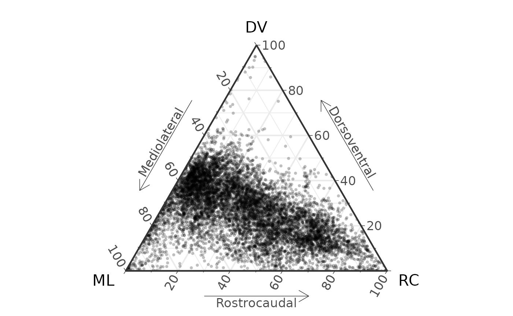
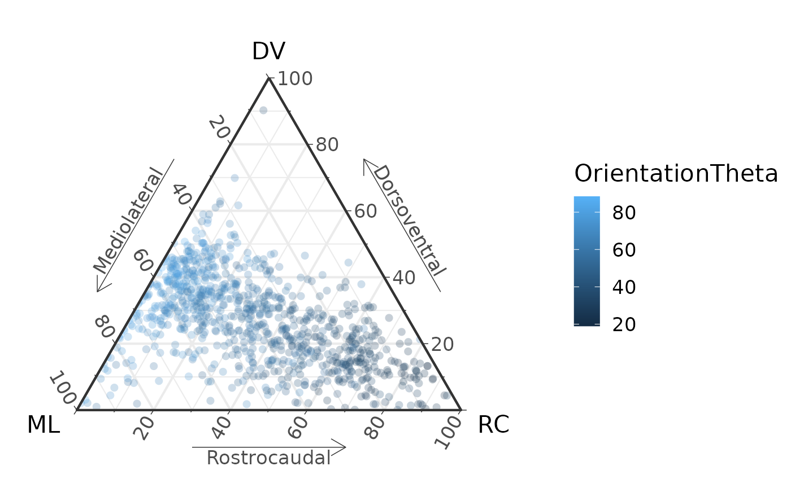
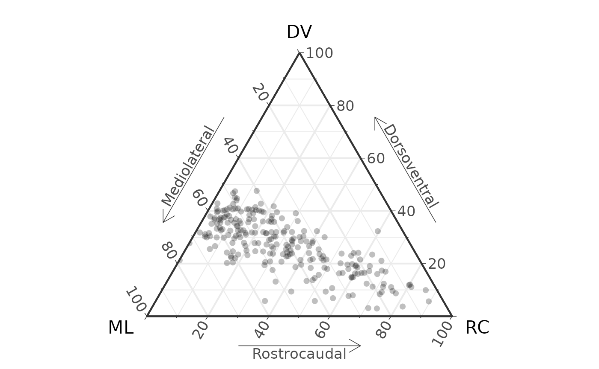

# Make a ternary plot from Xfiber data

The package has two functions for importing data from Avizo Xfiber. The
native “Save as” format from Xfiber is an excel file encoded in XML.
This file can be opened in Excel and resaved as a `.xlsx` file. Or
simply kept as `.xml`. The two functions are:

1.  [`read_xfiber_xml()`](https://middleton-lab.github.io/MuscleTernary/reference/read_xfiber_xml.md):
    read the raw `.xml`
2.  [`read_xfiber()`](https://middleton-lab.github.io/MuscleTernary/reference/read_xfiber.md):
    read a resaved Excel file

The easiest option is to just keep the original file. Here we load the
starling supracoracoideus data from Sullivan et al., 2019:

``` r

library(MuscleTernary)

D <- read_xfiber_xml(system.file("extdata",
                                 "AV069_SC.xml",
                                 package = "MuscleTernary")) |>
  mutate(muscle = "SC")
D
#> # A tibble: 8,945 × 11
#>    track_num pt_pair x_origin y_origin z_origin x_insertion y_insertion
#>        <dbl> <chr>      <dbl>    <dbl>    <dbl>       <dbl>       <dbl>
#>  1         0 0,1       11273.   21712.   59873       11536.      21755.
#>  2         0 1,2       11536.   21755.   59935.      11767.      21791.
#>  3         0 2,3       11767.   21791.   59986.      11998.      21830.
#>  4         0 3,4       11998.   21830.   60040.      12227.      21868.
#>  5         0 4,5       12227.   21868.   60094.      12487.      21916.
#>  6         0 5,6       12487.   21916.   60161.      12787.      21983.
#>  7         0 6,7       12787.   21983.   60242.      13102.      22053.
#>  8         0 7,8       13102.   22053.   60327.      13434.      22141.
#>  9         0 8,9       13434.   22141.   60415.      13750.      22241.
#> 10         0 9,10      13750.   22241.   60504.      14082.      22371.
#> # ℹ 8,935 more rows
#> # ℹ 4 more variables: z_insertion <dbl>, OrientationTheta <dbl>,
#> #   OrientationPhi <dbl>, muscle <chr>
```

There are almost 9,000 points, because each individual track is made of
many sub-segments, which are all returned separately. We also add a
column `muscle`, which is required by
[`coords_to_ternary()`](https://middleton-lab.github.io/MuscleTernary/reference/coords_to_ternary.md).
For a single muscle, it does not matter what the value of `muscle` is,
just that the column is present.

Making ternary plots from Xfiber data is similar from here on. Convert
the coordinates to ternary space and plot with
[`ggtern()`](https://rdrr.io/pkg/ggtern/man/ggtern.html).

``` r

coords_to_ternary(D) |>
  ggtern(aes(x = x, y = y, z = z)) +
  geom_point(size = 1, alpha = 0.25, pch = 16) +
  labs(x       = "ML",
       xarrow  = "Mediolateral",
       y       = "DV",
       yarrow  = "Dorsoventral",
       z       = "RC",
       zarrow  = "Rostrocaudal") +
  theme_bw(base_size = 16) +
  theme_showarrows()
#> Ignoring unknown labels:
#> • xarrow : "Mediolateral"
#> • yarrow : "Dorsoventral"
#> • zarrow : "Rostrocaudal"
```



We might be interested in color coding the points by angle. We will also
randomly select 10% of the points:

``` r

D |> 
  slice_sample(prop = 0.1) |> 
  coords_to_ternary() |>
  ggtern(aes(x = x, y = y, z = z, color = OrientationTheta)) +
  geom_point(size = 2, alpha = 0.25, pch = 16) +
  labs(x       = "ML",
       xarrow  = "Mediolateral",
       y       = "DV",
       yarrow  = "Dorsoventral",
       z       = "RC",
       zarrow  = "Rostrocaudal") +
  theme_bw(base_size = 16) +
  theme_showarrows()
#> Ignoring unknown labels:
#> • xarrow : "Mediolateral"
#> • yarrow : "Dorsoventral"
#> • zarrow : "Rostrocaudal"
```



## Plotting only the endpoints of tracks

You may not want to plot all 9,000 of the individual track segments. One
approach is to draw a 3D vector from the starting point to the ending
point and reconstruct the orientation of that vector.
[`find_track_ends()`](https://middleton-lab.github.io/MuscleTernary/reference/find_track_ends.md)
reduces the raw output of
[`read_xfiber_xml()`](https://middleton-lab.github.io/MuscleTernary/reference/read_xfiber_xml.md)
to a set of vectors where each represents the endpoints of each track.

``` r

Ends <- D |> 
  find_track_ends()
Ends
#> # A tibble: 235 × 10
#>    muscle track_num x_origin y_origin z_origin x_insertion y_insertion
#>    <chr>      <dbl>    <dbl>    <dbl>    <dbl>       <dbl>       <dbl>
#>  1 SC             0   11273.   21712.   59873       26581       31187.
#>  2 SC             1   17940    25397.   66452.      29257.      33204.
#>  3 SC             2    7106.   17896.   37854.      14036.      25704.
#>  4 SC             3   10703.   21624.   42854.      17019.      27151.
#>  5 SC             4    6053.   16492.   37108.      26756.      32152.
#>  6 SC             5   11624.   22765.   44346.      18291.      28160 
#>  7 SC             6    6097.   17808.   44433.      18203.      26318.
#>  8 SC             7   13334.   24563.   46451.      15528.      26932.
#>  9 SC             8    7544.   17677.   38248.      20352.      27327.
#> 10 SC             9    5878.   17414.   41933       26669.      33029.
#> # ℹ 225 more rows
#> # ℹ 3 more variables: z_insertion <dbl>, OrientationTheta <dbl>,
#> #   OrientationPhi <dbl>
max(Ends$track_num)
#> [1] 234
```

And passing through
[`coords_to_ternary()`](https://middleton-lab.github.io/MuscleTernary/reference/coords_to_ternary.md)
and plotting:

``` r

Ends |> 
  coords_to_ternary() |>
  ggtern(aes(x = x, y = y, z = z)) +
  geom_point(size = 2, alpha = 0.25, pch = 16) +
  labs(x       = "ML",
       xarrow  = "Mediolateral",
       y       = "DV",
       yarrow  = "Dorsoventral",
       z       = "RC",
       zarrow  = "Rostrocaudal") +
  theme_bw(base_size = 16) +
  theme_showarrows()
#> Ignoring unknown labels:
#> • xarrow : "Mediolateral"
#> • yarrow : "Dorsoventral"
#> • zarrow : "Rostrocaudal"
```



## Reference

Sullivan, S. P., F. R. McGechie, K. M. Middleton, and C. M. Holliday.
2019. 3D Muscle Architecture of the Pectoral Muscles of European
Starling (*Sturnus vulgaris*). [Integr Org Biol
1:oby010](http://dx.doi.org/10.1093/iob/oby010)
